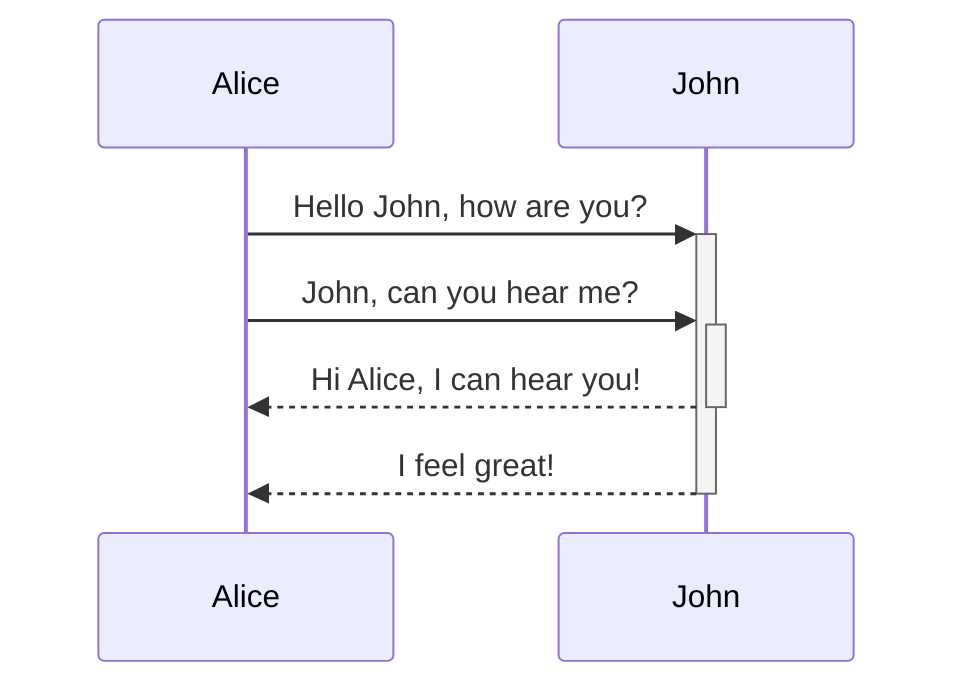

```java

```

<SwmSnippet path="/app/src/main/java/pedidofacil/com/br/pedidofacil/LoginActivity.java" line="107">

---

This is a sample code to generate documentation.

```java
    protected void onCreate(Bundle savedInstanceState) {
        super.onCreate(savedInstanceState);
        //require for facebook SDK use
        FacebookSdk.sdkInitialize(getApplicationContext());
        setContentView(R.layout.activity_login);


        // Set up the login form.
        mEmailView = (AutoCompleteTextView) findViewById(R.id.email);
        populateAutoComplete();

        mPasswordView = (EditText) findViewById(R.id.password);
        mPasswordView.setOnEditorActionListener(new TextView.OnEditorActionListener() {
            @Override
            public boolean onEditorAction(TextView textView, int id, KeyEvent keyEvent) {
                if (id == R.id.login || id == EditorInfo.IME_NULL) {
                    attemptLogin();
                    return true;
                }
                return false;
            }
        });

        Button mEmailSignInButton = (Button) findViewById(R.id.email_sign_in_button);
        mEmailSignInButton.setOnClickListener(new OnClickListener() {
            @Override
            public void onClick(View view) {
                attemptLogin();
            }
        });

        mLoginFormView = findViewById(R.id.email_login_form);
        mProgressView = findViewById(R.id.login_progress);


        loginButton = (LoginButton) findViewById(R.id.login_button);
        facebookButton = (Button) findViewById(R.id.facebook_button);
        permissionNeeds = Arrays.asList("user_photos", "email",
                "user_birthday", "public_profile");
        callbackManager = CallbackManager.Factory.create();
        loginButton.setReadPermissions(permissionNeeds);

        loginButton.registerCallback(callbackManager,
                new FacebookCallback<LoginResult>() {
                    @Override
                    public void onSuccess(LoginResult loginResult) {

                        System.out.println("onSuccess");

                        String accessToken = loginResult.getAccessToken()
                                .getToken();
                        Log.i("accessToken", accessToken);

                        GraphRequest request = GraphRequest.newMeRequest(
                                loginResult.getAccessToken(),
                                new GraphRequest.GraphJSONObjectCallback() {
                                    @Override
                                    public void onCompleted(JSONObject object,
                                                            GraphResponse response) {

                                        Log.i("LoginActivity",
                                                response.toString());
                                        try {
                                            id = object.getString("id");
                                            try {
                                                URL profile_pic = new URL(
                                                        "http://graph.facebook.com/" + id + "/picture?type=large");
                                                Log.i("profile_pic",
                                                        profile_pic + "");

                                            } catch (MalformedURLException e) {
                                                e.printStackTrace();
                                            }
                                            name = object.getString("name");
                                            email = object.getString("email");
                                            gender = object.getString("gender");
                                            birthday = object.getString("birthday");
                                        } catch (JSONException e) {
                                            e.printStackTrace();
                                        }
                                    }
                                });
                        Bundle parameters = new Bundle();
                        parameters.putString("fields",
                                "id,name,email,gender, birthday");
                        request.setParameters(parameters);
                        request.executeAsync();
                    }

                    @Override
                    public void onCancel() {
                        System.out.println("onCancel");
                    }

                    @Override
                    public void onError(FacebookException exception) {
                        System.out.println("onError");
                        Log.v("LoginActivity", exception.getCause().toString());
                    }
                });

        // ATTENTION: This was auto-generated to implement the App Indexing API.
        // See https://g.co/AppIndexing/AndroidStudio for more information.
        client = new GoogleApiClient.Builder(this).addApi(AppIndex.API).build();
    }
```

---

</SwmSnippet>



<SwmMeta version="3.0.0" repo-id="Z2l0aHViJTNBJTNBUGVkaWRvRmFjaWwlM0ElM0FkaWVnb2NhODA=" repo-name="PedidoFacil"><sup>Powered by [Swimm](https://app.swimm.io/)</sup></SwmMeta>
